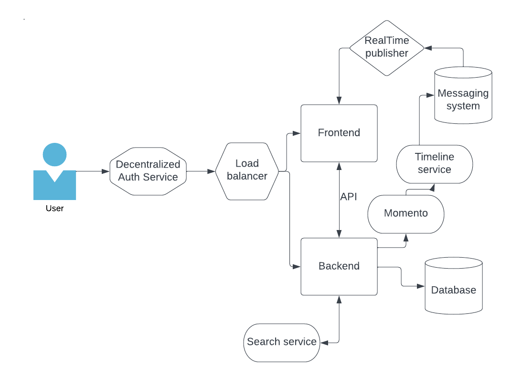
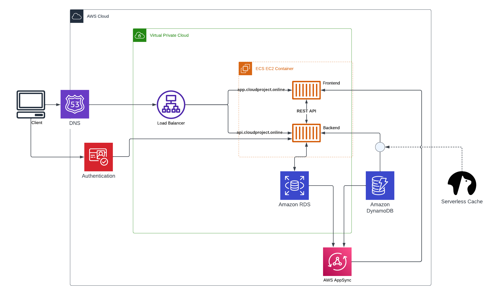
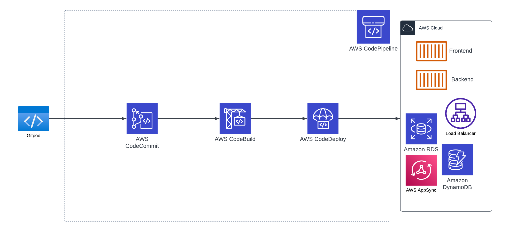

# Week 0 — Billing and Architecture

## Required homework

### Conceptual Architecture Design

This is the conceptual design diagram I created for our project.

[Link to Lucid chart Conceptual Architecture Design](https://lucid.app/lucidchart/fcd3ab72-8f02-44a9-845f-db2c66afed2a/edit?viewport_loc=-447%2C-117%2C2048%2C1033%2C0_0&invitationId=inv_6888c504-d144-4521-83da-40d53ff26f43)

### Logical Architecture Design

This is the logical architecture design that I have created for this project. It shows the blueprint in more detail than the above conceptual design.

[Link to Lucid chart Logical Architecture Design](https://lucid.app/lucidchart/0da37d56-1063-454c-bf36-3c03219363e4/edit?viewport_loc=-312%2C693%2C2016%2C942%2C0_0&invitationId=inv_4cd07f48-8140-438c-a811-5d2a229b9aec)

### AWS CLI, creating a budget and billing alarm

Homework included creating an admin user and AWS credentials, as well as installing AWS CLI on Gitpod. 

The budget was created through AWS CLI on Gitpod based on the budget and budget notifications JSON-files on the AWS/JSON-folder. There is also a JSON file for the billing alarm. It required first a new SNS topic for which the subscription had to be confirmed via email. After that, the actual Cloudwatch alarm could be created through AWS CLI.

## Homework challenges

### Architectural diagram of the CI/CD pipeline

As an additional challenge, I attempted to create an architectural diagram of the CI/CD pipeline according to my current understanding. I will be adding the missing part as the bootcamp progresses.

[Link to Ludic chart CICD pipeline diagram](https://lucid.app/lucidchart/3a0ffc37-6c56-406a-aec8-087c4a7aaf8f/edit?viewport_loc=-47%2C51%2C2197%2C1108%2C0_0&invitationId=inv_62646d85-2424-48d6-a3e4-e97a79e2aa2e)
