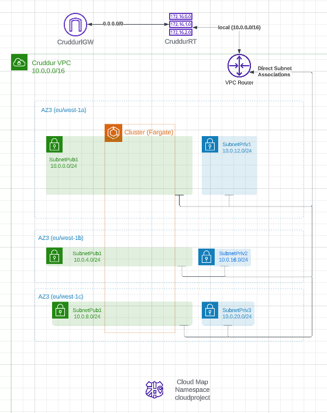
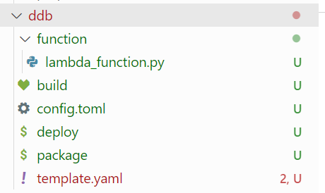
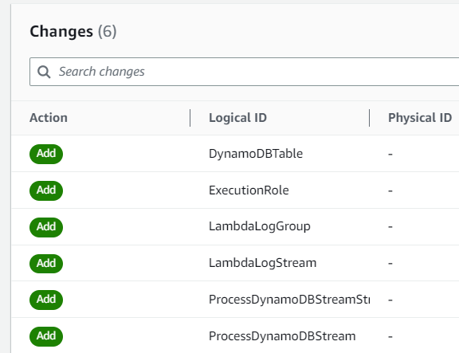
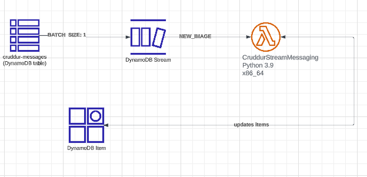
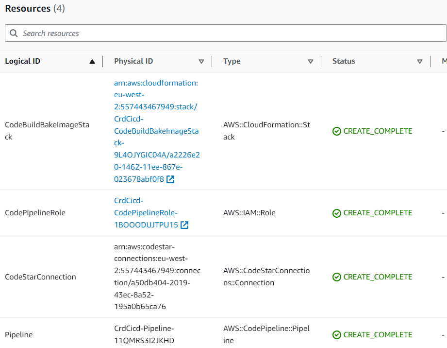
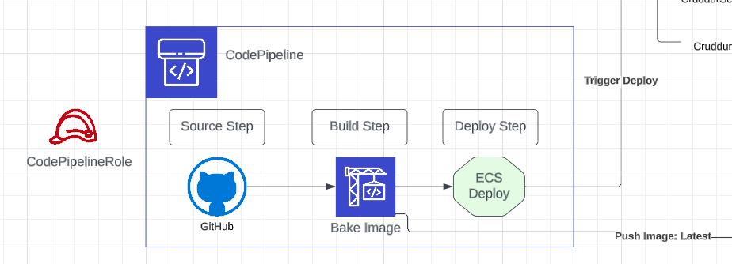
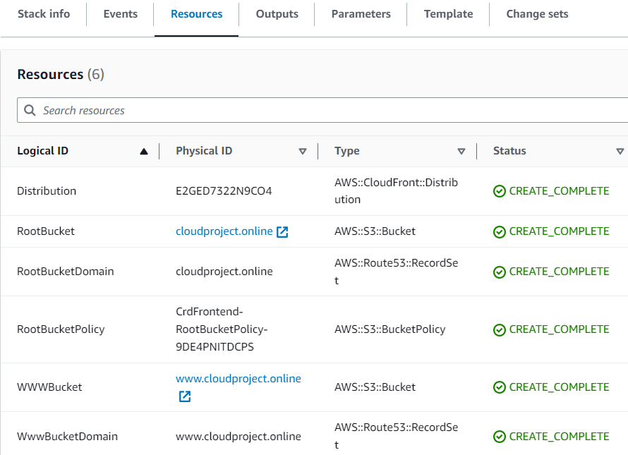
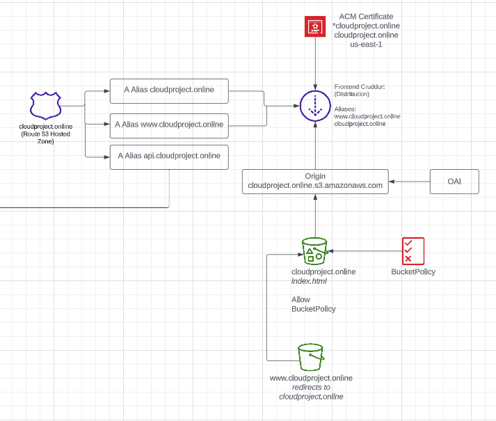
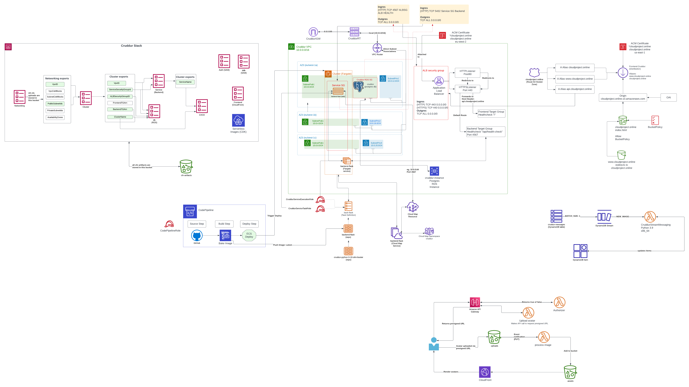

# Week 10-11 — CloudFormation

Week 10-11 concentrates on re-creating our infrastructure with CloudFormation (and AWS SAM for one of the stacks). There are in total seven stacks:
- Networking
- Cluster
- Service
- Database (RDS)
- DynamoDB
- CI/CD
- Static Website hosting for frontend

After creating each of the stacks, the resources were added to a diagram.

The serverless image processing that was completed in week 8 has not been incorporated into CloudFormation.

## Live-Stream Cloudformation (CFN) Basics

During the live stream, we went through some general ideas on how you can organize your CloudFormation (CFN) template. You could for example have your networking infrastructure in one CFN template and application in another. It is often easier to make smaller sections and then later combine them if you have to. Otherwise, it’s difficult to know what’s going on if they fail. You also lose some flexibility if you combine the stacks together. 

You have to consider how your different stacks are going to be connected. For example, our cluster is probably going to reference the networking stack. The database might be orphaned or connected to networking. 

In terms of debugging, we learn that the easiest way to debug CFN is by using CloudTrail. 

The general structure of the CFN template for each stack is that there are parameters, which can be referred to in other parts of the template to avoid having to hard-code those values. Below that you list all the resources you want to create with the CFN template. At the bottom, you can list outputs, which can be imported into other stacks. These are cross-stack references, which will be heavily used in our CFN stacks. 

## CFN Networking Layer

In terms of networking, going through the core components is very important. It would be possible to use the default VPC for this project, but the decision was made to create a new VPC using CFN.

First, a networking folder was created in the CFN folder. A ``template.yaml`` was created in the folder. Also a bin script was added for deploying the networking stack. Added also Readme.md that has instructions to create an S3 bucket for CFN artifacts. This bucket was created directly in the AWS console instead of CFN. 

Next, it was necessary to choose the CIRD-block: how many containers we need. For our use case/16 is good. If you have a container that fails in one AZ, you would usually want to have another container in a different region. This would require more IP addresses. 

Added InternetGateway to the CFN template. It’s not automatically attached, so AttachIGW had to be separately added to the template. 

A route table and two routes were added to the template - one route to the internet gateway and another to local. This turned out to be the wrong decision, as  the route to local is created automatically and this is why our template failed. So we actually have to set up only one route.

Added subnets. We have 3 public subnets and we don’t currently need private subnets but we create 3 in case we are going to need it later for example for our database. Although it will make it harder to connect to our database, it is best practice. 

Added availability zones as parameters to the CFN template, so that we don’t have to write those every time for each subnet, but refer to them by using ``!Ref``.

Deploying the CFN template creates a ChangeSet in the AWS console. We have to manually go and open the ChangeSet, which lists all the resources that will be created with that stack. The change set can then be manually executed through the console. 

## CFN Networking Layer - Diagram

The diagram shows the three public subnets that are used as well as three private subnets that are currently not used but were created for possible future use. The Fargate cluster spans across three public subnets:



## CFN Cluster Layer

Similarly to the networking stack, this stack also has a ``template.yaml`` file and a cluster-deploy bash script. 

Added NetworkingStack as a parameter so that its resources can be referred to.

Added the same resources to the template that were created in the previous stages of the project: Fargate Cluster, Application Load Balancer, Listeners, Security Groups and Target Groups.

The ACM certificate could also be created through CloudFormation, however, we will instead refer to the CertificateARN we created earlier. 

The fact that we created our own VPC, created some extra challenges as our security groups were not first correctly within the VPC. It would have been more straightforward to use the default one and it is easier, but it was good practice.

## CFN Toml

As we need to use the previously created Certificate ARN, we need a way to import it. You could also hardcode it, but a better solution is to have a toml-file to import it that value. For this purpose we used cfn-toml, which is a Toml configuration for bash scripts using CloudFormation. 

Started by running ``gem install cfn-toml`` and added the command also to Gitpod.yml. Next added ``config.toml`` file for aws/cluster. Then the cluster-deploy was modified to use the toml file.

# CFN Cluster Layer - Diagram

The below diagram shows other parts of the cluster layer, apart from the Fargate cluster itself:

[cluster_diagram](assets/cluster_diagram_week10.png)

## CFN Service Layer

The fundamental question for this layer was, whether it should be done by using the bash commands we have already as it will create CFN template anyway. We decided not to take this approach, but instead create a CFN template for this layer. The template will create a Fargate service, task definition, task role and execution role.

As with other layers, the service layer needs a ```template.yaml`` and ``config.toml`` file.  Cluster Stack and Networking Stack were imported as we need to cross-reference them.

Deploying the template first resulted in an error due to missing target group values. Added backend and frontend targetgroupARN as outputs on cluster template. Re-deployed cluster and added the values as imports on the Service template. You could also do mappings in this kind of case.

Next error was, because it couldn’t create a target group with the same name that already existed. It does automatically delete the existing TG, however, it seems that it starts to create a new one so quickly that the old deletion is not completed yet. So we thought the custom names might not work and deleted the frontend and backend tg names from the cluster template and added a tag instead so that we can still identify them. 

Now after re-deploying the stack, the problem is that the backend task fails the health check. The first step of debugging was to open up the security group rules to see if those are causing the issue. Also, the security group rules for the database had to be checked to ensure that it allows traffic from the service. 

In the end, the issue was caused by the security group rules for the backend task. The port we had used in the security group was wrong. When the traffic comes to the load balancer, it terminates the HTTPS connection. It was thought that the target group would be smart enough to convert the port 80 traffic to 4567, however, that was not the case. So the port needs to be 4567 instead of 80. 

Another thing that still needed doing was updating the Route 53 hosted zone to point to the new load balancer. The health-check was still unhealthy as it was not able to create a connection to the RDS. We had to move to the next step of creating CFN for RDS. After that,  the health check returned healthy status.

## CFN Database Layer (RDS)

Setting a custom name can be tricky because if you tear it down and set up a new one it can cause problems, however, as DB is not something you need to tear off often, it is ok to choose a custom name for RDS. 

We can either set up a new db and load the data there (bootstrap it). Or we could create a snapshot from the existing database and create a new one from it, but it probably doesn’t make sense in our case as the db doesn’t have much data.

Added service security group to cluster template as SG needs to be created before we create the service so that it has access to the DB. 

Added the database username to db ``config.toml``, but can’t add a password there as it doesn’t support env vars. The password will be passed as an Gitpod env var through the db-deploy bash script:

``
--parameter-overrides $PARAMETERS MasterUserPassword=$DB_PASSWORD \
``

After the database was deployed we had to manually update the connetion_url in the Parameter store to match the connection string of the new database.

The order we are now deploying our stacks:

1. Networking stack
2. Cluster stack
3. DB stack
4. Service stack

## Service and Database - Diagram

We want to document on the diagram everything that is important in terms of architecture, everything that will stop things from working in case we do something wrong. For example, inbound/outbound rules in terms of backend-flask service task would be something that will easily cause issues. 

## DynamoDB using SAM

DynamoDB was created by using AWS SAM, which is an extension of AWS CFN.

We need permissions for Lambda and were looking at some ready policies first, but it seems that those give quite general permissions, so we decided not to use those but are writing our own roles instead.

The ddb-folder had to be organized differently to the previous stacks as there were difficulties for the template to access the Lambda in another folder. The SAM file also had to be separated in build, package and deploy files for it to work correctly. 



The same kind of re-organizing could be done for other stacks as well, which could make the project easier to navigate. 

During deployment, we first ran into an error due to the Python version on Gitpod being different from the Python version required by the Lambda function. 
The solution for this is that we have to use containers to build as we have a different runtime on Gitpod. Added to sam build ``--use-container`` flag to implement this. 

After this deployment worked and created a change set:




## DynamoDB - Diagram

The diagram for the DynamoDB service is very simple as the structure is very straightforward. All services are located outside of the VPC:



## CFN CI/CD

The implementation of CFN for CI/CD was done with a similar structure as other CFN stacks. ``Template.yaml`` and ``config.toml`` -files were created in the CI/CD folder. 

The difference in this stack is that it is going to include a nested stack. A nested stack can be used when you have code that you would like to re-use. Added this as a resource on template.yaml:

``
Resources:
  CodeBuildBakeImageStack:
    Type: AWS::CloudFormation::Stack
    Properties: 
      TemplateURL: nested/codebuild.yaml
``

Created manually ``codepipeline-cloudproject-artifacts`` S3 bucket as it is needed for the template to work.

These are now the resources that the CI/CD stack will create:



## CI/CD - Diagram

We haven’t yet incorporated CDK code into CloudFormation and we might not be able to as it takes time. But it would be a good practice to have everything in CloudFormation so that you can simply tear it down and re-deploy easily.

We made a very simple diagram as our pipeline is simple. You could add more information about the configuration options if there is something you might otherwise forget or if something doesn’t make sense.



## CFN Static Website Hosting for Frontend

The frontend was previously implemented as a Fargate container. Now a decision was made to change the architecture to CloudFront instead as this is something that had been discussed throughout the bootcamp.

Created CloudFront folder and as usual template.yaml and config.toml. We could use SAM for this, but there is usually no benefit when there are not things like Lambdas involved. 

The CFN for frontend creates the following resources. As it creates also new A records on Route 53 hosted zone, the previously created one had to be removed for  this to work.  It also creates two S3 buckets, one for the root domain and another for the WWW domain:



## Frontend diagram

The below diagram shows the frontend resources:



## Complete Diagram

The completed diagram contains all of the above parts that were created during this week's bootcamp and additionally, the serverless image processing diagram that I created during weeks 6-7:



The complete diagram can be viewed in [Lucidchart](https://lucid.app/lucidchart/c0367745-b41d-4b29-8371-39111ea4907d/edit?viewport_loc=386%2C1137%2C2772%2C1383%2C0_0&invitationId=inv_aa6e85b3-2f6b-4908-879f-38eca7f7b88d). 
