# Week 2 — Distributed Tracing

## Required homework

### Honeycomb

During this week's live lesson we learned about Honeycomb and instrumented our backend Flask -application to use OTEL (Open Telemetry) with Honeycomb.io as the provider. We started by creating a new environment called 'bootcamp' and copying the API key from Honeycomb.io and setting that as an environment variable on Gitpod. We added OTEL settings in the docker-compose -file. We did this for the backend now, but the same could be later added for the frontend -application as well. We followed instructions on Honeycomb.io to complete the installation, which required adding code to requirements.txt and App.py -files. 

We hardcoded new span in the 'home activities' (to say  we are returning hard-coded data) and we now had two spans visible in Honeycomb every time we make a request to that backend route:

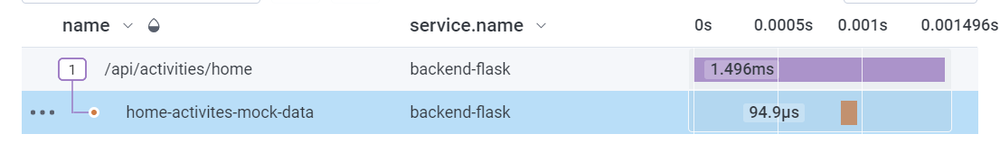

As I have in the previous week added a healthcheck on this endpoint, it is now sending a request to this route every 30 sec, which means there is always a new trace created. Each trace has 'count 2', which means there are two spans:

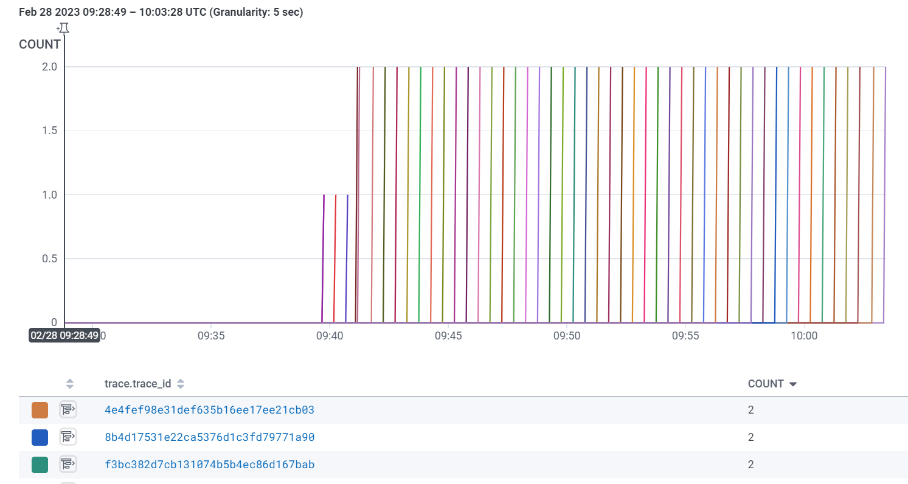

Our cloud environment is now sending standardise messages to Honeycomb.io and Honeycomb stores them in the database and gives a UI to look at them. 

### X-ray

Also, X-ray will be used in this project. It is not as straightforward to configure as Honeycomb and there were a lot more steps and troubleshooting required. One of the advantages that X-ray offers, is a service map, which is a visual representation of your services. At this stage of our application, it is not very helpful as the application is quite simple, however with larger applications it can help to see each integration point and where successes and failures happen.

We started by adding aws-xray-SDK library to the requirement for the backend and adding code to App.py. A file for sampling (xray.json) was added to the root of the project. A new x-ray group was then added via aws xray SDK and the group was visible in the AWS console:

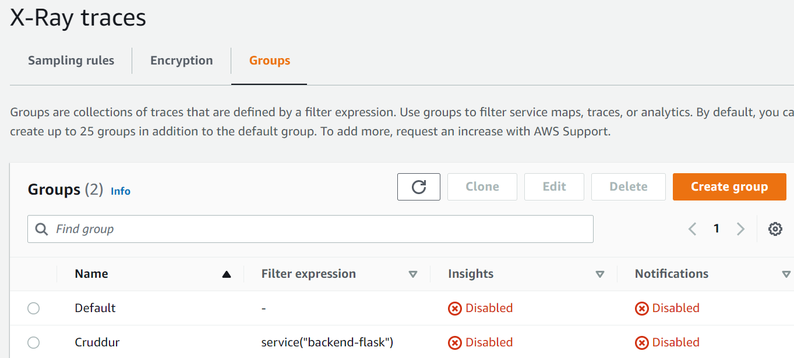

Additionally, a sampling rule was created through SDK, as it is important to determine what kind of data you want to collect as collecting everything would be too much to go through and might end up creating additional costs. 

For setting up an X-ray daemon as a container, we were using a docker image from Dockerhub. the image is maintained by AWS. The image was added to the docker-compose -file. Also, environment variables for backend-flask were added in docker-compose. 

After the container was run and a request to our API endpoint was done, we could see the following logs for the x-ray container. It was now sending 'segments', which are similar to traces in Honeycomb:

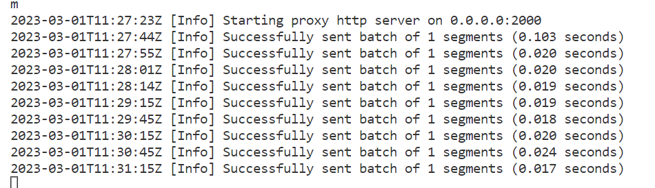

The segments were visible in the AWS console:

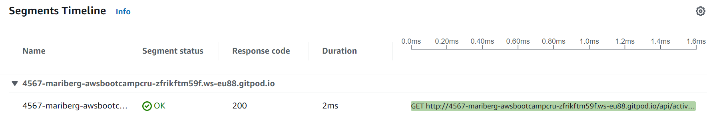

X-ray captures are a feature we could add to routes on app.py. According to AWS documentation, 'A decorator is provided to easily capture basic information as a subsegment on user-defined functions'.  A custom name can be given to these routes and the given route will be visible in the console when a request is sent to the route:

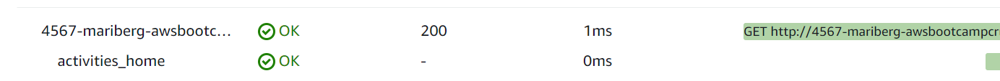

We also added a subsegment on user activities service. Now, when sending a request to the route, there are two lines created on the AWS console. The first is the captured route from app.py (activities users) and the send is from the mock data that was created in 'user_activities.py':

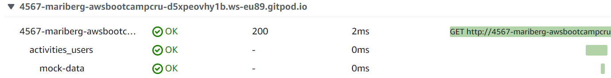

### Rollbar

We configured Rollbar for the project. It is a cloud-based bug-tracking and monitoring solution, which supports multiple programming languages and frameworks. Configuring it for Flask was straightforward. The idea is, that when whenever we run into an error, we check what kind of information Rollbar can give us about the error. It will be even more useful in production, where we don't otherwise have easy access to error messages as we have in development. 

We started by creating a Rollbar account, adding blinker and rollbar to the requirement.txt-file for Flask. We took a token from the Rollbar account and added that as an environment variable on Gitpod. We added import statements and passed Rollbar access to the token to backend-flask on the docker-compose -file. and added code to app.py. and adding an endpoint that produces an error to test that Rollbar works. This is what my Rollbar account shows when a request is sent to the route:

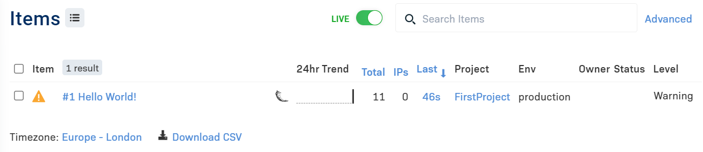

We made an additional test by breaking code in 'home activities', which produces this error in Rollbar:

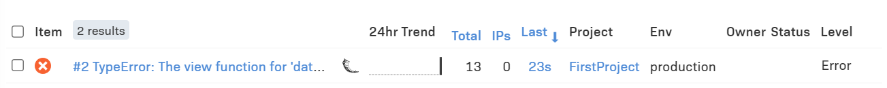

### CloudWatch Logs

Cloudwatch logs is a log management service built into AWS and Watchtower is a log handler for AWS cloudwatch logs. 

We started by installing Watchtower, importing and configuring Cloudwatch to app.py, adding environment variables to docker-compose and adding code to app.py to log errors. We added code to home_activities.py to see if we can log 'homeActivities'. These are the logs now visible in my AWS console:

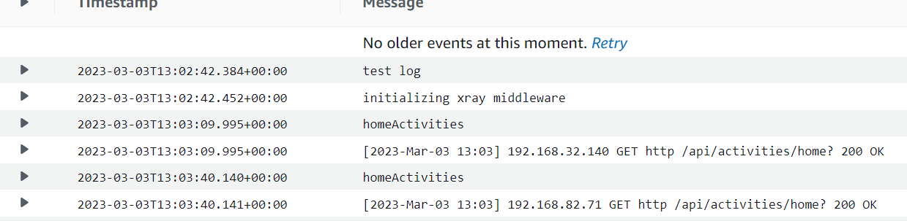

## Homework challenges

As a challenge this week I implemented another Honeycomb customer span. I implemented in 'notifications' service in a similar way we implemented the span in home activities. It creates a span when we return mock data for notifications:

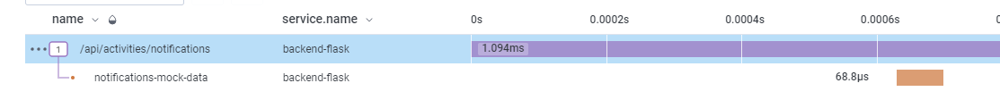

As observability is such a crucial topic, I spend this week a lot of time just learning more about the tools we are using and the background of why we have chosen to use them. I am planning to complete more challenges around this topic later when I'm able to.
