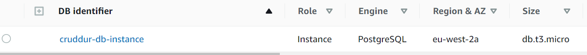
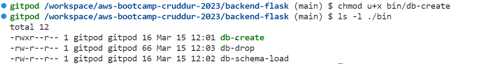
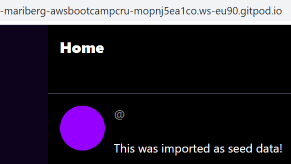
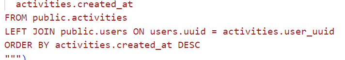
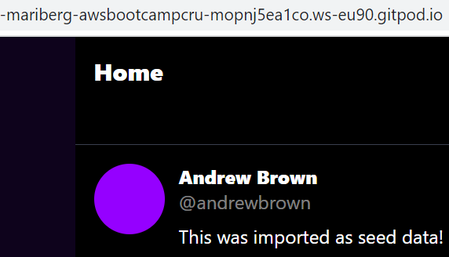
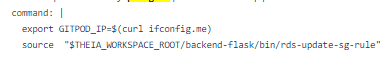
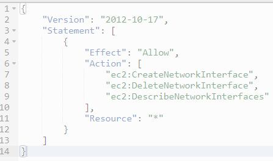
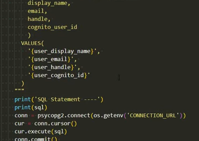
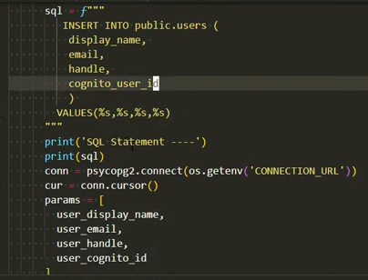
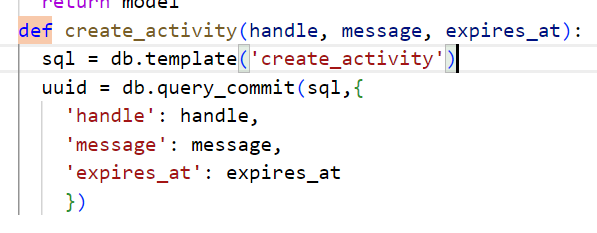

# Week 4 — Postgres and RDS

## Create RDS Postgres Instance

The RDS instance was provisioned through the AWS CLI with this command:

``
aws rds create-db-instance \
  --db-instance-identifier cruddur-db-instance \
  --db-instance-class db.t3.micro \
  --engine postgres \
  --engine-version  14.6 \
  --master-username root \
  --master-user-password password \
  --allocated-storage 20 \
  --availability-zone eu-west-2a \
  --backup-retention-period 0 \
  --port 5432 \
  --no-multi-az \
  --db-name cruddur \
  --storage-type gp2 \
  --publicly-accessible \
  --storage-encrypted \
  --enable-performance-insights \
  --performance-insights-retention-period 7 \
  --no-deletion-protection
  ``
 
 It is important to note, that many of the selected options are not security best practices, as it was important to keep the costs down during this project and stay within the free tier whenever possible. In production, you would want to use for example backups, deletion protection and AWS secret manager to store passwords. In production, the database should also not be made publicly accessible, although during this project the security group of the subnet is going to keep us protected even when the URL is exposed. 
 
 The new database was now visible in the AWS console:
 
 

This instance can be temporarily stopped through the AWS console for 7 days to save costs.

!!!!!!!!!!!! Programmatically update a security group rule

## Create a schema SQL file by hand

A new folder called ``db`` was created for the backend and within it file ``schema.sql``.  This file creates two tables for our schema: users and activities. The following command creates the schema locally:

``psql -Upostgres cruddur < db/schemal.sql -h localhost -U postgres``

## Work with UUIDs and PSQL extensions

Extension UUID is used to obscure the user ids. Using chronological numbers is usually not a good idea as this would allow anyone to easily check how many registered users you have. This command was added in the beginning of ``schema.sql``:

``CREATE EXTENSION IF NOT EXISTS "uuid-ossp";``

## Bash scripting for common database actions

A new folder called ``bin` was created for database operations bash scripts. The first bash scripts were added for creating a database, dropping a database and schema load. These files are not executable by default, so a command had to be run to make these files executable:

When the files were executable, a new database could simply be created by running ``./bin/db-create`` in the terminal and dropped by running ``./bin/db-drop``.

Schema-load utilizes 'realpath': ``schema_path="$(realpath .)/db/schema.sql"``, which is a hand way of getting your path where you are running the command and it is used a lot in bash scripts. 

An if-statement was also added to schema-load in order to run the command either in the dev or prod environment. 

``db-connect`` was created to easily connect to the database and seed.sql to add some seed data (mock data) to the dev database.

Finally file ``db-setup`` was created to automatically run all bash commands, so that you don't have to manually run them every time the project is re-started. This is something that naturally wouldn't be done in production.

## Install Postgres Driver in Backend Application

Now that the tables had been created, it was possible to start writing SQL commands. However, for that, a driver for PostgreSQL called ``psycopg`` had to be installed. Several things were added to ``requiremtns.txt`` -file:
- connection pool: the idea is to re-use connections instead of creating new ones every time
- using Lambda would create a new connection every time it is run, which would require using an RDS proxy in order to use a connection pool. However, when ECS is used and containers are run only for a certain amount of time, it is possible to take advantage of connecting pooling without needing an RDS proxy.
- a new file called ``db.py`` was created to create a new connection. The connection ULR was also added to docker-compose.
- imported the pool in ``homeactivities`` and added code to use the pool connection. The originally used mock data was removed as it wouldn't be needed anymore.

## Operate common SQL commands

The first SQL query was now working:

It has now been updated to an actual SQL query instead of the wildcard. It has a join to the users table:

Now also the username is visible:

## Connect Gitpod to RDS Instance

In order to connect Gitpod to the RDS instance, we had to create a connection URL that contained the database endpoint URL taken from AWS console and save that as an environment variable. The security group had to also be updated as the default settings allow inbound traffic only from the same security group. An inbound rule had to be created for the Gitpod IP address. A handy way of finding the Gitpod IP address was running the command ``curl ifconfig.me``

It was possible to update the security group directly in the AWS console, however, the issue with Gitpod is that the IP address will change every time Gitpod is re-launched. In order to facilitate this the security group ID and SG rule group ID had to be copied from the AWS console and saved as environment variables. The following CLI command can be run to update the IP address for the security group rule:

``
aws ec2 modify-security-group-rules \
--group-id $DB_SG_ID \
--security-group-rules "SecurityGroupRuleId=$DB_SG_RULE_ID,SecurityGroupRule={Description=GITPOD,IpProtocol=tcp,FromPort=5432,ToPort=5432,CidrIpv4=$GITPOD_IP/32}"
``

To run this command automatically, a new file called ``rds-update-sg-rule`` was created. The following command in ``.gitpod.yml`` now saves the IP address and runs the rule every time Gitpod is re-launched:
 

Now after swapping the connection URL to production URL in docker-compose, Gitpod was connected to the AWS RDS database. Schema could be created by running ``./bin/db-schme-load prod``, however, no data could be seen at the front end as the production database is literally empty. 

## Implement a Lambda and Cognito Trigger to insert the user into the database

In order to test the production database, a Lambda function is needed to help. It will probably be very similar to a Postgres driver that will be used later in the project. 
- this Lambda function is used only for development
- it was created manually in AWS console
- code for Lambda was saved in ``cruddur-post-confirmation.py``
- environment variable that was needed for Lambda: Postgres URL
- a Lambda layer was added - psycopg2 python postgresql client library
- added to Cognito a Lambda trigger
- Lambda also needed a VPC to work. And for VPC a new permission policy was needed:

Later while refactoring the code, it was noticed that the Lambda code was created in a way that allows SQL injection. In order the prevent that, the code was changed from:

to:

## Create new activities with a database insert

A new endpoint needed to be added in order to write messages in the Cruddur app. Some SQL was added to ``create_activity.py`` similarly as in ``home_activities``. Some time was spent refactoring code in order to make it more easily readable and manageable:

- moved pool creation to db.py
- wrapped everything into a class Db so that the whole class could simply be imported to ``create_activity``.

During debugging, it was noted that the ``create_activity.py`` was difficult to debug as it contained the SQL query. A decision was made to place all SQL queries in their own file in order to make it easier to manage. The SQL folder was created with three files: ``create.sql``, ``home.sql`` and ``object.sql``. The ``create_activity`` file had now only this instead of the whole SQL query:

In order for this to work, also a new function called ``template`` was needed in ``db.py``.

After several small changes, the final issue with my code was that there was a hardcoded user_handle in ``app.py``, which had to be modified from 'andrewbrow' to my own username. After that it was possible to post new cruds:

These cruds were also returned when SQL query was made to the RDS database, so it was clear that this was now working as intended.
