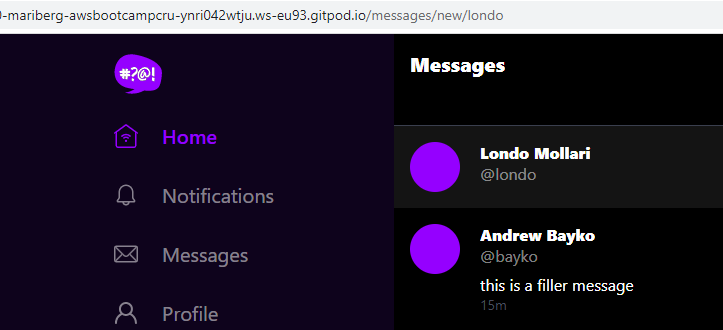
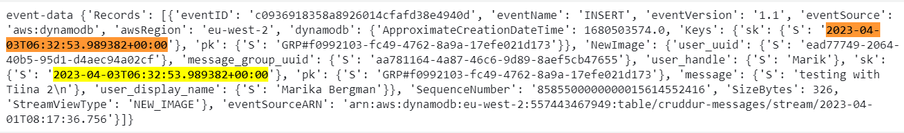
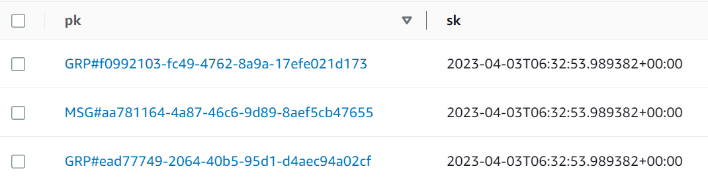

# Week 5 — DynamoDB and Serverless Caching

## Data modelling a direct messaging system using a single table design

This application uses a simple table design, which makes the data modelling quite challenging. It is crucial to have your data mapped or you will end up with something that doesn't either work or becomes very expensive. To make it as cost-effective as possible, it is important to choose such a design that enables as much as possible of the data you need to be easily available, without using GSIs (global secondary index). When starting to design the database model, the first step is to list the different access patterns. For this application there are five initial access patterns, although more might be needed to be added (such as changing a username):

- Showing a single conversation:
  Partition key: messageGroup_uuid and sort key: created_at
- A list of conversations
  Partition key: user_uuid and sort key: last_reply_at
- Creating a message
- Adding a new message to an existing message groups
- Update a message group by using DynamoDB streams

## 	Implement schema load script

This script loads your schema to DynamoDB. At the beginning of the script, there is a conditional that allows us to use the script either for the local development environment or production. Some of the default options for the schema had to be modified to be compatible with AWS free tier. For example, ReadCapacityUnits and WriteCapacityUnits can't be above certain values for the free tier.


## 	Implementing seed script

The seed file for DynamoDB is written in Python and has the option to be used for either development or production. In order to create the seed file, a function in SQL is needed to get the user uuid from RDS. Once the uuid is obtained, the seed file can be used to populate the DynamoDB tables.

The seed script has two functions, ``create_message_group`` and ``create_message``. The function called ``create_message`` is adding a message to DynamoDB and uses "my user" details obtained in the above-mentioned SQL query. The table name has been hard coded to the query as there is only one table. Function ``create_message_group`` is used to create a new message group. This function is called twice as there need to be two message groups, one from the perspective of each user.

The seed script also has a hardcoded conversation as mock data to populate the message group. Seeding data like this will be done only for development and for the production it would be implemented differently as write operations can end up being expensive.

## Implementing scan script

A scan script was created to easily scan the database and see what is there. This is for development only as a scan can be expensive in production. After using the seed script first, the scan option returns all data that was included in the seed script.

## Implementing pattern scripts for read and list conversations

These two pattern scrips are actually for two of the access patterns (A and B).The script to read a conversation is called ``get-conversation``. There are two different options for how you can filter the conversations, either looking for conversations in a certain year or between certain dates. It will be decided later which of these ways is going to work better for this application.``List-conversations`` is created to list all of the conversations that the user has. In this script, there is also a function called ``get_my_user_uuid``, which first gets the current user UUID as that gets updated every time the database is re-launched.

## Implement Update Cognito ID Script for Postgres Database

In order to implement the access patterns a new library file called ``ddb.py`` was created. All the functions will be directly in this file. The table name is hard coded and this would be a problem if a separate staging environment was used in the future.

Hardcoded mock data has been used until now for the users. However, now it's time to start pulling the real user information from Cognito.

``update_cognito_user_ids`` file was added to ``db-folder``. It first gets all of the users from Cognito, and then updates the user ID. This needs to be run after each setup.

After this script was working, also a function called ``data_message_groups`` in ``app.py`` could be updated from using a hardcoded handle to using the Cognito user id.


## 	Implementing (Pattern B) listing message groups

The first change was made to ``message_groups.py``. it originally returned mock data, but now it returns actual data from DynamoDB:

```
class MessageGroups:
  def run(cognito_user_id):
    model = {
      'errors': None,
      'data': None
    }
    
    sql = db.template('users','uuid_from_cognito_user_id')
    my_user_uuid = db.query_value(sql, {
      'cognito_user_id': cognito_user_id
      })
    
    print(f"UUID: {my_user_uuid}")
    
    ddb = Ddb.client()
    data = Ddb.list_message_groups(ddb,my_user_uuid)
    print("list_message_groups")
    print(data)
    
    model['data'] = data
    return model
```

The ``list_message_groups`` function is quite similar to the list-conversations script that was created earlier. The only difference is that it doesn't simply dump json, but iterates through the items and does something to them.

At this point also some changes were needed at the frontend. As many pages didn't have any access token requirement, this had to be corrected. The following code was added to ``messageGroupPage``, ``messageGroupsPage`` and ``MessageForm``:

```
const res = await fetch(backend_url, {
        headers : {
          Authorization: `Bearer ${localStorage.getItem("access_token")}`
        },
        method: "GET"
      });
```

## Moving checkAuth function into it's own file

The ``checkAuth`` function was originally created for pages that required it, but it was more purposeful to abstract it into a more generic function, that several pages could use. This function was created in the lib-folder. Manually created checkAuth functions had to be removed from ``MessageGroupPage`` and ``MessagesGroupPage``. The ``checkAuth`` function was then imported from the new file. It will need to be added later for other pages as well.

## Implementing (pattern A) listing messages in message group

The partition key for this pattern is messageGroup_uuid as that is the most straightforward way to access messages in a certain conversation.

The implementation was started by changing the function data_messages in app.py from using uuid instead of the handle. Some code was added to ``messages.py`` to display the messages. The application now displayed message_groups on the left and messaged on the right:


## Implement (Pattern C) Creating a Message for an existing Message Group into Application

The first step was to modify ``MessageForm.js`` at the frontend, which is used for sending messages. Code was added for two scenarios. If a user is starting a brand new conversation, there won’t be any message_group_uuid, which means a handle is used. If a handle is present, a brand new message group is created, otherwise, the message is added to an existing message group:

```
if (params.handle) {
        json.handle = params.handle
      } else {
        json.message_group_uuid = params.message_group_uuid
      }
```

A new page for params.handle will need to added at some point.

At the backend the function ``data_create_message`` in ``app.py`` had to be modified. As the application is not using hardcoded data anymore, it was changed to use message_group_ids and cognito_user_ids.  An if-statement was added for two options, either creating a message to create a brand new message or to push a message to an existing message group (updating the message group).

Additionally ``create_message.py`` has to now have two modes:

```
if (mode == "update"):
      
......

if (mode == "create"):

.....
```

A new function ``create_message`` was added to ``ddb.py`` to insert the message into DynamoDB.

Created file create_message_users.sql for SQL script to get the user IDs from RDS to add to the messages. 


## Implementing (pattern D) creating a message for a new message group

To implement a new conversation, a new URL is used. In ``app.js``:

```
{
    path: "/messages/new/:handle",
    element: <MessageGroupNewPage />
  },
```

A file for the new page was then created. 

Created a new service called ``users_short.py`` and imported it to ``app.py`` and created a new route for it in ``app.py``. Added also new SQL query to short.sql:

```
SELECT
    users.uuid,
    users.handle,
    users.display_name
FROM public.users
WHERE
    users.handle = %(handle)s
```

Added to frontend components ``messageGroupNewItem.js`` which is a very stripped-down version of ``messageGroupitem.js``. 

Also ``messageGroupFeed.js`` had to be updated to import messageGroupNewItem and code was added there to now conditionally have an option if this is a completely new item.

Now when navigating to our the local url /messages/new/otherUser there is  the option to start creating a new message to the otherUser:



Next the function ``create_message_group`` was added to ``ddb.py``. This was a complicated function to create and it does the following:

- generates a message group uuid
- sets a message group from my perspective
- sets a message group from other user’s perspective
- creates the message we need to have
- batches data structure into batch write


## Implementing (pattern E) updating a message group using DynamoDB Streams

The DynamoDB stream is used to update the message group when a new message is created. Message groups have last_reply_at as a sort key, so this obviously needs to be updated every time a new message is created to a message group. Now was the time to move from using a local DynamoDB table to production. A database was created in production by using the command for schema-load script: ``./bin/ddb/schema-load prod``. The database was now in the AWS console and the DynamoDB stream could be manually turned on in the console. The stream uses a Gateway endpoint, which provides access to DynamoDB among a few other services. There is no additional cost to this type of VPC endpoint. This endpoint was also created in the AWS console and it was linked to the existing VPC and route table. 

Next step was to manually create a new Python Lambda function called cruddur-messaging-stream. As stream captures all events, the Lambda code will select that it wants to take action only on events starting with 'MSG' (messages instead of message groups).  The function then does a database query, which returns two message groups that have this message and it will then delete the sort keys and insert them with updated values (the created_at of the last message as the last_reply_at). As it's not possible to update the sk, you have to delete it and recreate it. The more correct way would be to wrap this in a transaction, but this is difficult to implement.

However, for the query to work so that the two message groups can be returned, a secondary index is needed. This is because the partition key of the message group is user_uuid, which means we are not able to make a query based on message_group_uuid unless making a scan, which would not be cost-effective. The global secondary index was added to the schema:

```
 GlobalSecondaryIndexes= [{
    'IndexName':'message-group-sk-index',
    'KeySchema':[{
      'AttributeName': 'message_group_uuid',
      'KeyType': 'HASH'
    },{
      'AttributeName': 'sk',
      'KeyType': 'RANGE'
    }],
    'Projection': {
      'ProjectionType': 'ALL'
    },
    'ProvisionedThroughput': {
      'ReadCapacityUnits': 5,
      'WriteCapacityUnits': 5
    },
  }],
```

This basically creates a clone of your primary table using the message_group_uuid as partition key, but the two tables are kept in sync. This GSI allows for querying the table based on the message_group_uuid attribute, in addition to the primary key attributes 'pk' and 'sk'. Now it is possible to easily access all of the message groups when the sk needs to be updated. 

Now the creation of new message will be captured by the DynamoDB stream, which triggers the Lambda function that will use the GSI to query all message groups where the message group uuid matches the partition key of the message. It will then replace the sk (last_reply_at) with the sk value (created_at) of the new message. These two values are now matching:






