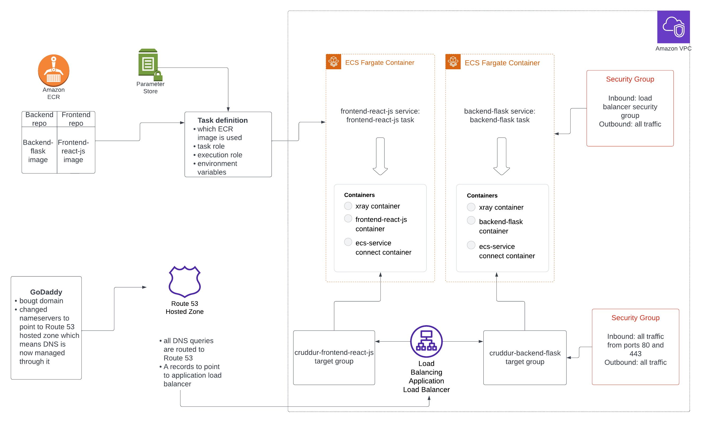

# Week 6 — Deploying Containers

This week was delivered together with week 7 so some topics are overlapping and the below topics might not have been complited exactly in this order.

There are several option to deploy containers on AWS: Lambdas, AppRunner, ECS EC2, Elastic Beantstalk, Fargate and Kubernetes. ECS EC2 was considered as an option for this bootcamp as it would be possible to utilize freetier, however you would have to manage compute and also connecting EC2 instances to Cognito is not straightforward as in EC2 the IP addresses are private, which means you would have to use NAT Gateway, which would create costs. In the end a decition was made to use Fargate serverless containers even though there will be some spend, but the solution is fully managed so you don't have to manage compute nad it is also a good migration path to Kubernetes. 

This diagram shows that parts of architecture that was covered during weeks 6-7:



### Provision ECS Cluster

Before starting with ECS, a way to make health checks was needed. A health-check for the Flask app was implemented by adding a simple endpoint to app.py and adding a Python script for it. 

After that an ECS cluster was provisioned for the Cruddur application. An ECS cluster is a grouping of containers that are used to run and manage containerized applications. It can contain either ECS EC2 instances or AWS Fargate tasks. The ECS cluster was created with a simple AWS CLI command:

```
aws ecs create-cluster \
--cluster-name cruddur \
--service-connect-defaults namespace=cruddur
```

After this command was run, there was an ECS cluster visible in the AWS ECS console, however it was empty without no infrastructure. 

### Create ECR repo and push image for backend-flask

To deploy an application on ECS, you will need to have images in AWS ECS (elastic container registry). An ECR repository was created through AWS Cli. The URI of the repository was then added as an environment variable on Gitpod.

For Cruddur a base Python image from Dockerhub is used, however it was better to have this image in ECR as using Dockerhub would just another point of failure in case there are connectivity issues. The slim-buster image was pulled from Docker hub, tagged and pushed to ECR. The Dockerfile was then updated to use the image from ECR instead of Dockerhub.

Next another ECR repo was created for backend-flask. This image was not only pulled as the previous image, but it actually had to be build:

```
docker build -t backend-flask .
```

It was again tagged and pushed to ECR and the ECR URI was saved as an environent variable on Gitpod.

### Deploy Backend Flask app as a service to Fargate

The first step in to create a task definition file, which is a little bit like a docker-compose file. It has a family name (backend-flask) and you only have one container in a single task definition file. You could add there multiple containers in theory, but you would be coupling them. That solution would make sense only for a sidecar (containers that share the same resources should be listed in the same task definition file). You add the health check on the task definition file, and also the task role (the role the container will have when it's running) and the execution role (the role it has when it executes). You also need to define CPU and memory within certain intervals when you use Fargate, opposed to EC2 where you could choose whatever you want. The roles were created through the console after having some issues with AWS cli and thoseat the moment give two priviledged access which has to be corrected later when using CloudFormation.

At this point also a way to store secrets was needed. As AWS secrets manager costs money, the decision was made to use AWS parameter store. Several environment variables such as AWS access keys and Rollbar & Honeycomb access tokens were passed from Gitpod to Parameter store. 

For the task definition a file called ``backend-flask.json`` was created in a ``task-definitions`` folder. By running a simple AWS CLI command a task definition was added to ECS:

```
aws ecs register-task-definition --cli-input-json file://aws/task-definitions/backend-flask.json
```

Whenever the task-definition is updated, this command has to be re-run.

The last step before being able to create a container, was creating a security groups. AWS CLI command was used to get the default VPC ID from AWS and then another CLI command to create a security group. The first try of creating a service run into a 404 permission error, which meant the permissions had to be tweaked a few times before it worked. 

Next a way to log into a backend container was needed in order to make debugging easier. A bash sript was added in the ECR folder. I had first issues logging into my container and kept receiving this error:


I troubleshooted this by running ``aws ecs describe-tasks``, which showed that executeCommand -flag was set up as 'false'. However my in the task definition file the enableExecuteCommand had been set up as 'true'. I spend some time on this, which helped me to understand the whole process and all the steps we had taken before. I think in the end the issue was that I had been looking at a task that didn't actually use the updated task defition and for this reason there was a discrepancy. By running update service and forcing a new deployment I was able to get my task have the enable execute command as 'true'. Loggin in to the container worked now:


Now when inside the container, it was possible to test the RDS container with a bash script that was created for this purpose. The connection just hang, which meant the security group had to be updated to allow the container to access it. The security group of the ECS service was added as an inbound rule to the security group of RDS database and after that the ``bin/db/test`` script could be run successfully. 

## Add service connect to backend-flask

The whole previous set-up for the backend container was done without service connect. The idea of service connect is that it makes it easier to connect to services running on ECS bu creating a private DNS namespace and DNS records for each service instance. This means there is no needto use IP addresses and update configuration files whenever those change. Also Route53 can be used be used with ECS service connect to make the services available to the public internet. 

The service connect configuration was added to the task definition:

```
    "serviceConnectConfiguration": {
      "enabled": true,
      "namespace": "cruddur",
      "services": [
        {
          "portName": "backend-flask",
          "discoveryName": "backend-flask",
          "clientAliases": [{"port": 4567}]
        }
      ]
    },
```
Service connect automatically creates a Fargate container to run the code in order to provide a reliable, scalable and securre runtime envronment to run the code. The backend service now showed two containers in 'healthy' status based on a successful health-check:


### Create a Dockerfile specifically for production use case - frontend

A task definition file was created for frontend and also a separate Dockerfile.prod was created as it is recommended to have a separate Dockerfile for production. For frontend the app has to be build for production, which is a step that wasn't done in development. In order to serve this files, Nginx will need to be used. 

The Dockerfile.prod uses a multi-stage build set-up where it first builds the application in a build-folder with the necessary environment variables and then serves the application from the build folder with nginx:

```
# Base Image ~~~~~~~~~~~~~~~~~~~~~~~~~~~~~~~~~~
FROM node:16.18 AS build

ARG REACT_APP_BACKEND_URL
ARG REACT_APP_AWS_PROJECT_REGION
ARG REACT_APP_AWS_COGNITO_REGION
ARG REACT_APP_AWS_USER_POOLS_ID
ARG REACT_APP_CLIENT_ID

ENV REACT_APP_BACKEND_URL=$REACT_APP_BACKEND_URL
ENV REACT_APP_AWS_PROJECT_REGION=$REACT_APP_AWS_PROJECT_REGION
ENV REACT_APP_AWS_COGNITO_REGION=$REACT_APP_AWS_COGNITO_REGION
ENV REACT_APP_AWS_USER_POOLS_ID=$REACT_APP_AWS_USER_POOLS_ID
ENV REACT_APP_CLIENT_ID=$REACT_APP_CLIENT_ID

COPY . ./frontend-react-js
WORKDIR /frontend-react-js
RUN npm install
RUN npm run build

# New Base Image ~~~~~~~~~~~~~~~~~~~~~~~~~~~~~~
FROM nginx:1.23.3-alpine

# --from build is coming from the Base Image
COPY --from=build /frontend-react-js/build /usr/share/nginx/html
COPY --from=build /frontend-react-js/nginx.conf /etc/nginx/nginx.conf

EXPOSE 3000
```

By using multi-stage build the final image size is kept small by discarding the build artifacts and only coyping the final build output to the production image. 

Nginx.conf -file was also added to the application to enable using it. 

### Create ECR repo and push image for fronted-react-js

It now possible to run ``npm run build`` to test that it builds correctly before deploying the container. After this a new repo for frontend was created and the image was built, tagged and pushed. Command ``docker run --rm -p 3000:3000 -it frontend-react-js`` could now be used to run this container individually locally:


 

### Deploy Frontend React JS app as a service to Fargate

Frontend service could now be deployed with service connect configuration and by using similar commands as above for backend.

After the deploying the container there also had to be a way to login to it locally in order to debug it more easily. A bash script didn't work as an error suggested it doesn't have bash. For this reason for connect script had to use 'bin/sh' instead of 'bin/bash'. Now logged into the container it was possible to check that this Alpine container actually has curl instead unlike the backend-container. This means it is possible to use curl to run a health-check. This was added to the task definition. 

The frontend application could now be accessed throug the load balancer url (creation of load balancer described in week 7 journal):


### Configure task definitions to contain X-ray and turn on Container Insights

X-ray was added to the backend task definition:

```
"containerDefinitions": [
      {
        "name": "xray",
        "image": "public.ecr.aws/xray/aws-xray-daemon",
        "essential": true,
        "user": "1337",
        "portMappings": [
          {
            "name": "xray",
            "containerPort": 2000,
            "protocol": "udp"
          }
        ]
      },
```

A bash script to update the task definition was also created so that the command doesn't have to be used every time.

After re-deplying the backend service, there were now three containers:


The Xray health-check shows unknown as there is no health-check setup for it. 


### Change Docker Compose to explicitly use a user-defined network

Docker creates a network every time 'docker compose up' is run. This could be seen with command ``docker network list``. This would be a default network if nothing was manually set up. The network was not manually changed to 'cruddur-net' on the docker-compose:

```
networks: 
  cruddur-net:
    driver: bridge
    name: cruddur-net
```

After this cruddur-net had to be added as a Docker network on all services in docker-compose and run -files. This can be checked by running ``docker network inspect``.

### Using Ruby generate out env dot files for Docker using erb-templates
