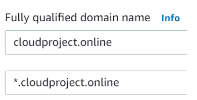
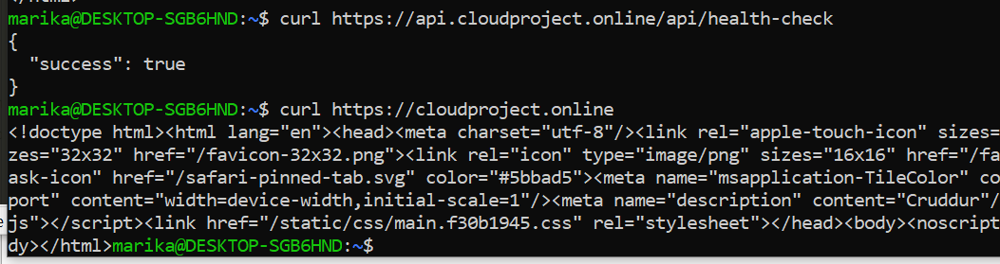
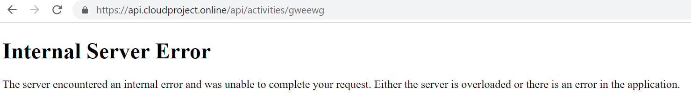

# Week 7 — Solving CORS with a Load Balancer and Custom Domain

This week was delivered together with week 6 so some topics are overlapping and the below topics might not have been completed exactly in this order. Week 6 journal shows a diagram of the architecture of all the services that were covered during these weeks.

### Provision and configure ALB (application load balancer) along with target groups

The application load balancer was created in the AWS console. The existing VPC and subnets were used and a new security group was created. All incoming and outcoming traffic was allowed. After that it was necessary to modify the security group that was previously created for the ECS service so that it wouldn't anymore allow incoming traffic from anywhere else than the load balancer. 

The ALB has two listeners, one for backend-flask listening to port 4567 and another for frontend-react-js listening to port 3000:


The backend health-check could now be accessed through the load balancer:


This means also the load balancer target group displays the status 'healthy'. 

The final step was to modify the load balancer to enable access logs. A new S3 bucket for the logs had to be created in order to achieve this.

### Create an SSL certificate via ACM

A certificate was created for the domain and wildcard:




### Manage your domain using Route53 via hosted zone

A Route53 hosted zone was created through the AWS console. The default nameservers at Godaddy (where the domain was bought from) were replaced with the hosted zone nameservers. Godaddy account now displays 'We can't display your DSN information because your nameservers aren't managed by us'. Now it was possible to modify the DNS information at the hosted zone. 

As there was now an ACM certificate, it was possible to create straight from there a CNAME record to Route 53. 

### Setup a record set for the naked domain to point to frontend-react-js and a record set for api subdomain to point to the backend-flask

Some modifications for the load balancer were needed after this. A rule to redirect HTTP 80 to HTTPS 443 was added first. The frontend is going to be the naked domain. Another route at the load balancer was created to add port 443 to the frontend target group. At this point, the ACM certificate had to be added as well for this to work. 

Now it was time to delete the previously created listeners for ports 3000 and 4567. A new rule could be added for the listener for port 443:


All requests to api.cloudproject.online would be forwarded to the backend target group where others could go to frontend target group. 

Next, an A record was created in the hosted zone to point to the load balancer, which was the main reason Route 53 is used in this project. By using an alias it is possible to point to the load balancer without defining a URL. Another A record was created for the subdomain. 

Both frontend and backend could now be accessed:



After these steps, the frontend docker image had to be rebuilt with the correct backend URL. The service had to be redeployed.

### Configure CORS to only permit traffic from our domain

The backend task definition was changed to include the actual URLs as it previously had "*" which meant traffic was permitted from any address:

```
     "environment": [
          {"name": "FRONTEND_URL", "value": "https://cloudproject.online"},
          {"name": "BACKEND_URL", "value": "https://api.cloudproject.online"},
        ],
```

The backend service was then redeployed. 


## Additional fixes that were implemented during this week

### Secure Flask by not running in debug mode

The issue with the Flask application was that it was running in debug mode, which meant anyone would be able to see the error messages and it is possible for attackers to add arbitrary Python code through the browser. The best option is to use debug mode only for development instead of production. This shouldn't be an issue as Rollbar is used for error logging. A separate Dockerfile.prod was created now for frontend and these flags were added ``"--no-debug", "--no-debugger", "--no-reload"``. Accessing a path that doesn't exist, doesn't anymore reveal access logs, instead, the user will just see a general internal server error:




### Refactor bin directory to be  at the top level

In order to make our work easier, a few additional scripts were created to easily build and push images without having to copy-paste commands. 

A script was created to force-deploy services so that it doesn't have to be manually done through the console every time changes are made to the image. The script will use the ARN of the latest task definition and then based on that force a new deployment. 

At this point, it was noted that having the bin directory within the backend-flask doesn't make sense as there are several scripts for the frontend as well. The folder was moved to the top level and every script had to be checked after that to make sure that the pathing is corrected. This took a few attempts as there were several things that had to be corrected such as the path for the backend health-check as it now caused the container to be unhealthy as the new bin folder was not reachable for the backend application. 

### Fix Messaging in Production

The application didn't work in a very user-friendly way, as it returned a 500 error when a user was trying to send a message to a person that didn't exist in the database. This was a problem in error handling, as this sort of situation should result in a 404 error. The issue in the code turned out to be a missing return statement. The function should return an empty object whenever there are no messages to return. When that was fixed, it doesn't run into a 500 error any more. However, this is still not a user-friendly solution though and has to be improved later.


### Implement Refresh Token for Amazon Cognito

The issue with the implementation was that the CheckAuth.js didn't attempt to renew the tokens after they expired. This meant that it was sometimes necessary to manually log in again, which made the app confusing to use. This code was added to the CheckAuth function:

```
.then((cognito_user_session) => {
        console.log('cognito_user_session',cognito_user_session);
        localStorage.setItem("access_token", cognito_user_session.accessToken.jwtToken)
```

There also had to be a way to reset the token in local storage every time an API call is made, to make sure that the token is fresh. This was implemented by adding a new function:

```
export async function getAccessToken() {
  Auth.currentSession()
  .then((cognito_user_session) => {
    const access_token = cognito_user_session.accessToken.jwtToken;
    localStorage.setItem("access_token", access_token)
  })
.catch((err) => console.log(err));
}
```

This function will now set the access token in local storage. The function is then used in other pages such as HomefeedPage, where the LoadData function gets the access token from local storage. 


### Correctly implementing time zones for ISO 8601

There were some issues with how the time zones were implemented. When creating a new messageItem, the application thought we are using the local timezone instead of UTC. A new file ``DateTimeFormat.js`` was added to set the timezone as UTC for a new message. The timezone will then be translated to the time that the browser is using:

```
const local_datetime = datetime.setZone(Intl.DateTimeFormat().resolvedOptions().timeZone);
```

The functions in this new file are now used in all different pages that require it. 
