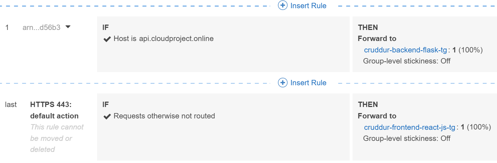

# Week 7 — Solving CORS with a Load Balancer and Custom Domain

This week was delivered together with week 6 so some topics are overlapping and the below topics might not have been complited exactly in this order.

### Provision and configure ALB (application load balancer) along with target 

The application load balancer was created in the AWS console. Existing VPC and subnets were used and a new security group was created. All incoming and outcoming traffic was allowed. After that it was necessary to modify the security group that was previously created for the ECS service os that it wouldn't anymore allow incoming traffic from anywhere else than the load balancer. 

The ALB has two listeners, one for backend-flask listening to port 4567 and another for frontend-react-js listening to port 3000:

The backend health-check could now be access through the load balancer:

This means also the load balancer target group displays status 'healthy'. 

The final step was to modify load balancer to enable access logs. A new S3 bucket for the logs had to also be created. 

### Manage your domain using Route53 via hosted zone
### Create an SSL certificate via ACM
### Setup a record set for naked domain to point to frontend-react-js
### Setup a record set for api subdomain to point to the backend-flask
### Configure CORS to only permit traffic from our domain

## Additional fixed that were implemented during this week

### Secure Flask by not running in debug mode
### Implement Refresh Token for Amazon Cognito
### Refactor bin directory to be top level

