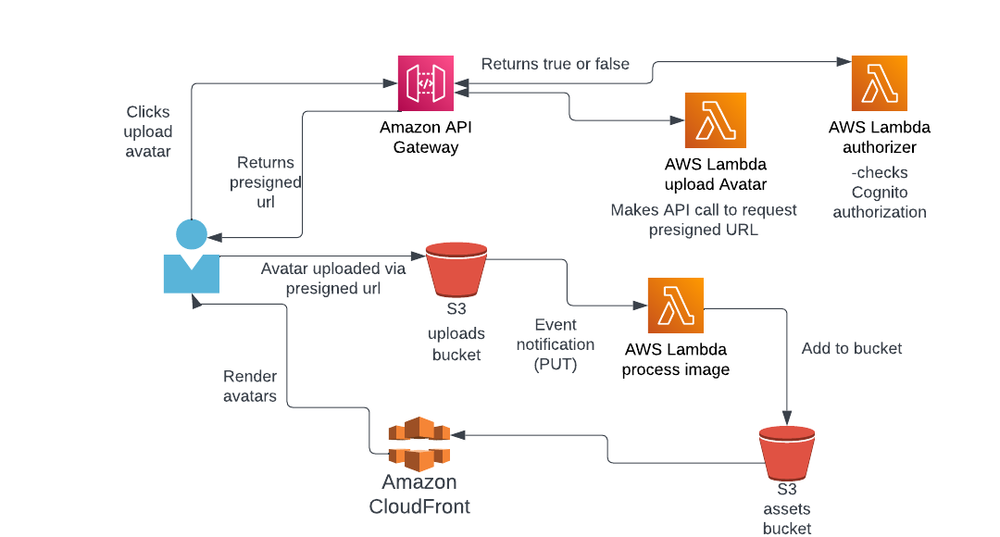
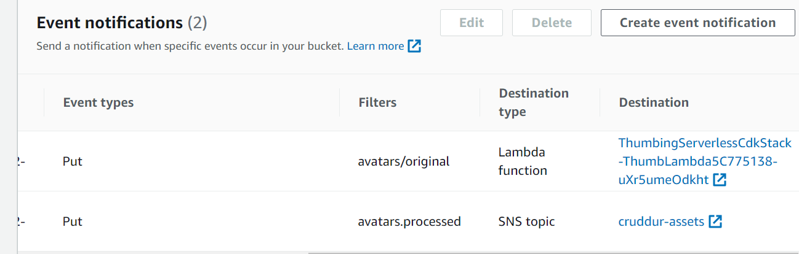
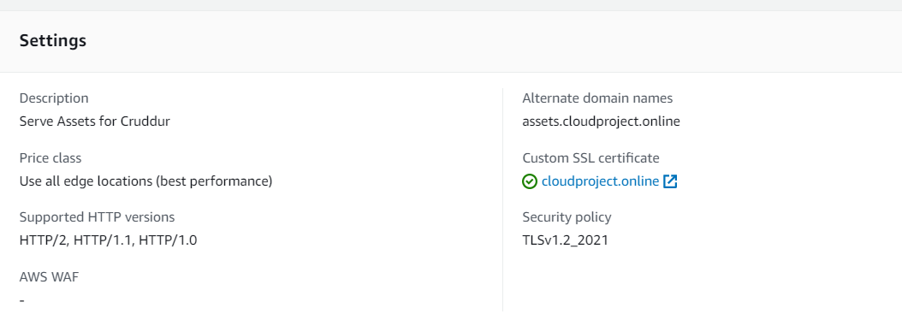

# Week 8 — Serverless Image Processing

The below diagram describes the serverless image processing that was completed this week. When the use wants to upload a new avatar, a request is sent to API Gateway, which is attached to two Lambda functions. The first Lambda checks the user's Cognito authorization and the second Lambda deals with cors and makes an API call to request a presigned URL. The presigned URL is then returned to the client and the image can be uploaded to the S3 bucket via it. The S3 bucket has an event notification that notifies a Lambda function of each new image. These images are then processed by the Lambda and added to another S3 bucket, from where they are server to the client via CloudFront.

### Implement CDK Stack

The first part of the project for the S3 uploads buckets, image processing Lambda and S3 assets bucket was created by using AWS CDK. The code can be found in the ``thumbing-serverless-cdk``-folder. This code consists of one stack, that creates a Lambda function, and S3 bucket and imports another S3 bucket that has already been created in the AWS console. Additionally it creates an S3 notification for the Lambda function and an SNS topic that could in the future be used for adding these images to the database:

### Serve Avatars via CloudFront

The CloudFront setup was done through the AWS console, although AWS CLI could have been used as well. The S3 assets bucket that has the processed images, was selected as origin for the CloudFront distribution. The domain name for the CloudFront distribution will be assets.cloudproject.online and the SSL certificate was connected to it:

The CloudFront distribution was added as an alias A record to the Route 53 hosted zone. Next the S3 bucket policy has to be modified to allow CloudFront to access it. 

The S3 bucket should also have a Lifecycle policy to delete the unprocessed images after a certain time and this will be implemented later. 

### 	Implement Users Profile Page

### Implement Users Profile Form

### Implement Backend Migrations

### Presigned URL generation via Ruby Lambda

### HTTP API Gateway with Lambda Authorizer

###  Create JWT Lambda Layer

### Render Avatars in App via CloudFront
