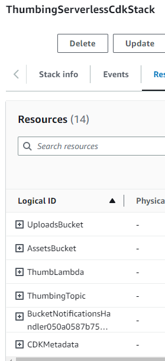
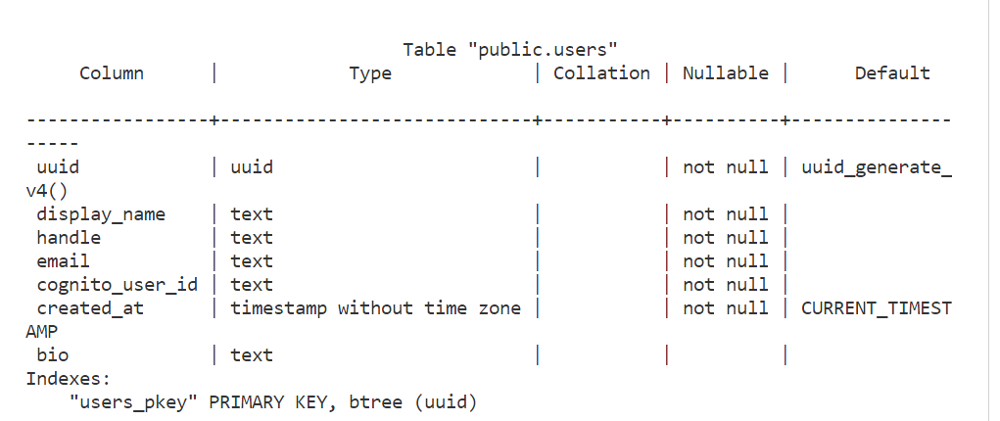
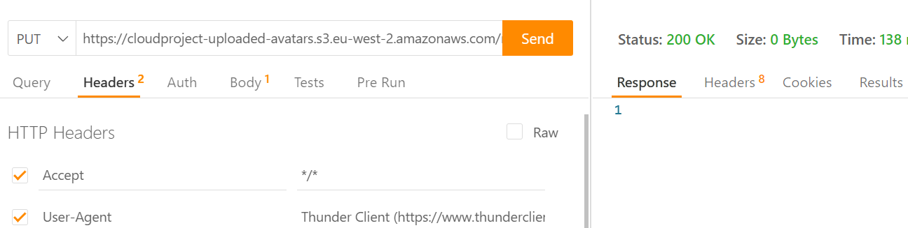
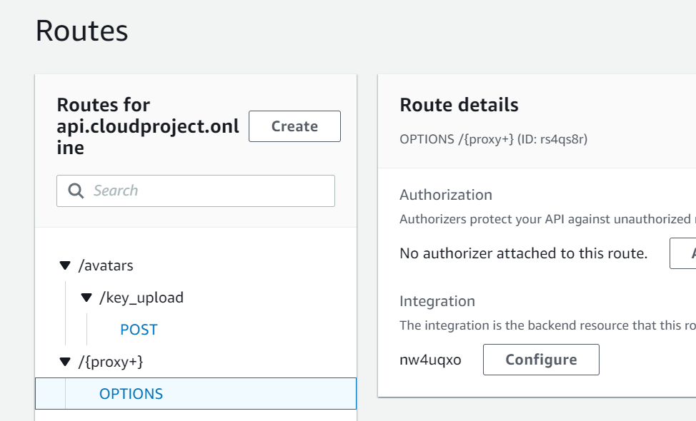
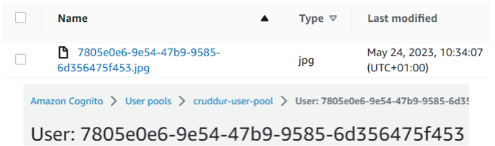
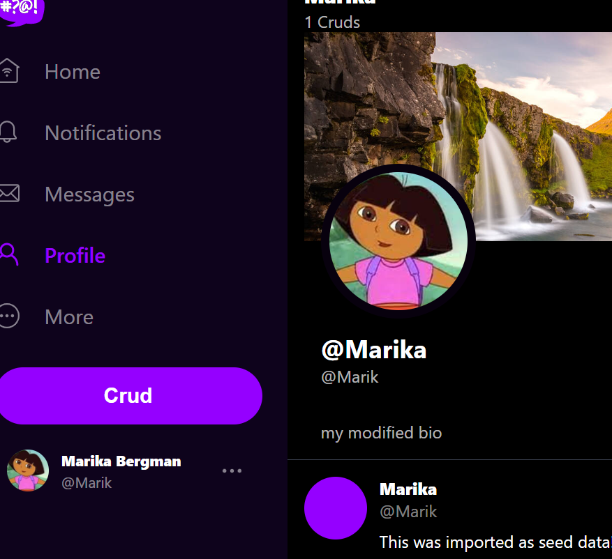

# Week 8 — Serverless Image Processing

The below diagram describes the architecture for the serverless image processing that was completed this week. When the user wants to upload a new avatar, a request is sent to API Gateway, which is attached to two Lambda functions. The first Lambda checks the user's Cognito authorization and the second Lambda deals with CORS and makes an API call to request a presigned URL. The presigned URL is then returned to the client and it can be used to upload the image to the S3 bucket. The S3 bucket has an event notification that notifies a Lambda function of each new image. These images are then processed by Lambda and added to another S3 bucket, from where they are served to the client via CloudFront.


### Implement CDK Stack

The first part of the project for the S3 uploads bucket, image processing Lambda and S3 assets bucket was created by using AWS CDK. The code can be found in the ``thumbing-serverless-cdk``-folder. This code consists of one stack, that creates a Lambda function, an S3 bucket and imports another S3 bucket that has already been created in the AWS console. Additionally, it creates an S3 notification for the Lambda function and an SNS topic that could in the future be used for adding these images to the database:

```
   createBucket(bucketName: string): s3.IBucket {
      ...
    }

    importBucket(bucketName: string): s3.IBucket {
      ...
    }

    createLambda(functionPath: string, uploadsBucketName: string, assetsBucketName: string, folderInput: string, folderOutput: string): lambda.IFunction {
      ...
    }

    createS3NotifyToLambda(prefix: string, lambda: lambda.IFunction, bucket: s3.IBucket): void {
      ...
    }

    createPolicyBucketAccess(bucketArn: string){
      ...
    }


    createSnsTopic(topicName: string): sns.ITopic{
      ...
    }
    
    createSnsSubscription(snsTopic: sns.ITopic, webhookUrl: string): sns.Subscription {
       ...
    }

    createS3NotifyToSns(prefix: string, snsTopic: sns.ITopic, bucket: s3.IBucket): void {
      ...
    }
```

The stack was deployed with command ``cdk deploy``:



### Serve Avatars via CloudFront

The CloudFront setup was done through the AWS console, although AWS CLI could have been used as well. The S3 assets bucket which has the processed images, was selected as origin for the CloudFront distribution. The domain name for the CloudFront distribution will be assets.cloudproject.online and the SSL certificate was connected to it:


The CloudFront distribution was added as an alias A record to the Route 53 hosted zone. Next, the S3 bucket policy has to be modified to allow CloudFront to access it. 

The S3 bucket should also have a Lifecycle policy to delete the unprocessed images after a certain time and this will be implemented later. 

### 	Implement Users Profile Page

Next, it was time to move back to working locally to implement the user's profile page. The goal was to see user activity data and also some user profile information. A new SQL query was added to ``show.sql`` and then the mock results for data were removed from ``user_activities.py`` and a function was added to return real data. 

A new component at the frontend called ``EditProfileButton`` was added. This button was imported to the UserFeedPage. 

Some refactoring for the code in ``ActivityFeed``, ``NotificationsFeedPage`` and ``HomeFeedPage`` was done as well.

Now the profile was working, however, it still looked like the feed so some changes had to be implemented to make it look more like a profile page. 

Next code was added to ``UserFeedpage.js`` to show cruds.count. This count also has to be stored somewhere. This could be done in Momento in the future, but currently it is simply implemented as a scan to DynamoDB.

Added new ``ProfileHeading.js`` and moved there the ProfileHeading information from ``UserFeedPage.js``. Spent a lot of time working on the CSS for this page. 

Added a new folder for banners in the S3 bucket and manually uploaded there a banner.

### Implement Users Profile Form

Created a new child component ProfileForm.js and added that to UserFeedPage.js. ProfileForm will be popping up when the button is clicked.

Added a new endpoint  ``api/profile/update`` on  ``app.py`` for the ProfileForm.

Added new service update_profile.py.

Added at the backend a new SQL script ``update.sql`` to update the user information. For this to work,  a new field called ‘bio’ is needed in the database. This could have been simply added, however, it was decided to add something like a migration tool. 

### Implement Backend Migrations

Is it worth using ORM or creating our own? When using ORM we will end up creating more dependencies and importing libraries - the decision was made to create our own. 

First, a folder called ``generate`` and a file called ``migration`` was created. The idea is that there are going to be many migration files that are named as datetime&name. There will be a table in the database listing all these and we will keep track of which is the latest and valid. The migration file creates a Python file and will place it in the backend db directory. A new folder ``migrations`` in backend/db is needed for this.

Added in bin/db two new files: migrate and rollback.

Added this to schema.sql:
``
CREATE TABLE IF NOT EXISTS public.schema_information (
  last_successful_run text,
  last_migration_file text
);
``

The idea is that it will show 0 if there are no migrations, otherwise, it will show the latest migration. Migrate currently doesn't have any error handling and there should be a catch to make it work properly.

Added this to our schema.sql to make sure that the last successful run will be added if it doesn’t exist, but it does exist (id 1 already exists), nothing will be done:

``
INSERT INTO public.schema_information (id,last_successful_run) 
VALUES(1, '0')
ON CONFLICT (id) DO NOTHING;
``

Running ``./bin/db/migrate`` now creates a new 'bio' field:



Running rollback deletes the field again.

The app now shows the bio and by clicking the edit button it is possible to update the bio and username. However, what it doesn’t yet do is show the updates in real-time without manually refreshing the page. 

### Presigned URL generation via Ruby Lambda

In order for the users to upload their avatars into the S3 bucket, a presigned URL is needed. The idea is that the creation of the presigned URL is triggered when there is a file upload with a file attached. 

The architecture is implemented with API Gateway and Lambda. The Lambda code is written in Ruby in file ``lambdas/cruddur-upload-avatar/function.rb``. When running the code locally with ``bundle exec ruby function.rb``, a presigned URL is created. The backend was then tested with Thunder client that was installed as a VC Code extension. Now when doing a PUT request (later changed to POST) to the presigned URL and adding the image as a binary attachment to the body, a mock.jpg file was added to the S3 bucket:



When adding the Lambda code to the AWS Lambda console, the bucket name had to be added as an environment variable. The code was then tested in the console to make sure it returns 200.

The function code was later modified to have a conditional statement for OPTIONS/POST request. The preflight (OPTIONS) request shall not return a body or upload the image to the S3 bucket. These things should happen only with the POST request. 

### HTTP API Gateway with Lambda Authorizer

The purpose of the Lambda authorizer is to check that the user has Cognito authorization. A new function called ``CruddurApiGatewayLambdaAuthorizer`` was created in the console and the function code from ``aws/lambdas/lambda-authorizer`` was added as a zip-file, although a modification was done to this later.

Next, an HTTP API Gateway was created in the console. The CruddurAvatarUpload Lambda was added as integration. The Authorizer Lambda was added as an authorizer for the API Gateway.

This setup worked, however, it resulted in a CORS error.

It was necessary to add a proxy integration for the API Gateway as HTTP API Gateway is used:



Also, the previously added CORS options had to be deleted from the API Gateway as CORS is dealt with by Lambda only. After this, the request still resulted in CORS error and I found a few missing things in my code. I had to split the jwt-token from the authorization in the Lambda function. Additionally, I had to add Cognito user pol and user pool client id as environment variables to the Lambda function. After these changes, the request returned a presigned URL.

The CORS issue was still persisting due to a missing CORS policy for the S3 bucket. The bucket also had to be made publicly available. 

###  Create JWT Lambda Layer

The CruddurAvatarUpload Lambda function continued to return the error ``"errorMessage": "cannot load such file --jwt"``. Various ways to fix this issue were tried, but to only way to make it work was to add a Lambda layer. A new bin script ruby-jwt was created:

```
#! /usr/bin/bash
gem i jwt -Ni /tmp/lambda-layers/ruby-jwt/ruby/gems/2.7.0
cd /tmp/lambda-layers/ruby-jwt
zip -r lambda-layers . -x ".*" -x "*/.*"
zipinfo -t lambda-layers
```

This code creates a zip file in the temp folder for all the Ruby gems. After that a Lambda layer could be created in the AWS console and the jwt layer could be selected as a custom layer. 

After this the only thing left to change is the object key. Each newly added avatar was saved to S3 as 'mock.jpg'. The format had to be changed to such that it is easily identifiable so the Cognito uuid will be used. This code was added to the Lambda function:

``object_key = "#{cognito_user_uuid}.#{extension}"``

The object name in the S3 bucket and user uuid in Cognito were now matching:




### Render Avatars in App via CloudFront

The application was at this point still rendering the hardcoded mock avatar and it was now time to display the avatar that has been saved for the user. Cognito sub was added to checkAuth.js setUser function:

``cognito_user_uuid: cognito_user.attributes.sub``

A new component called ``profileAvatar.js``, was created. It was then imported to the other components (profileInfo, profileHeading) that display the avatar. The application was now able to display the avatar based on the user’s uuid:


