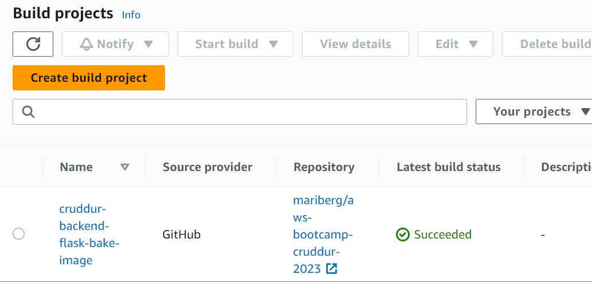
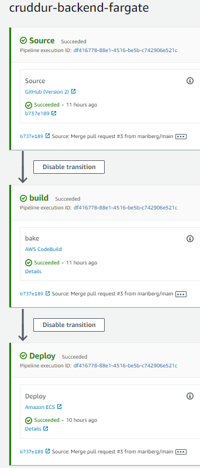
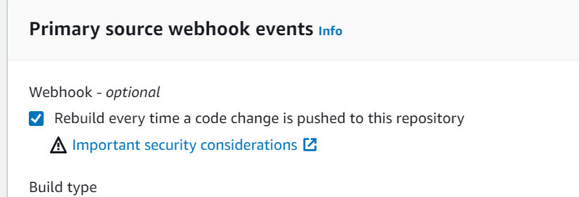
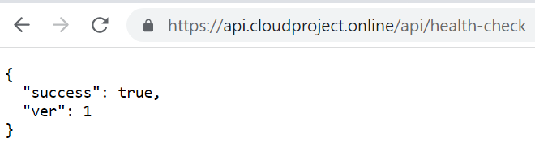

# Week 9 — CI/CD with CodePipeline, CodeBuild and CodeDeploy

There are going to be individual CI/CD pipelines for different services. This week the pipeline for the backend-flask Fargate service was created. When creating a new pipeline, a new connection called 'cruddur' to the Github repository was created. After the connection was created, the repository could be accessed from the CodePipeline. 

For the purpose of the pipeline a new branch 'prod' was created for the GitHub repository. 

### Creating CodePipeline

The pipeline was first created for two stages only: source and deploy. The source was connected to the GitHub repository. The deploy stage obviously wouldn't work without adding a build stage first and that was done as a separate project in the CodeBuild console.

###	Configuring CodeBuild

The build stage was created through the CodeBuild console as a new project. Selected settings that it will automatically build on push and on pull_request_merged. The environment is the runtime for the build environment. No VPC must be selected for the build stage in this scenario because it wouldn't be able to access ECR from inside a VPC. 

Added buildspec.yaml file to the root of the backend project. It contains a collection of build commands that are needed to run the build. 

CodeBuild also needs permissions to access ECR, which means the IAM codebuild role's permissions had to be modified to contain various ECR related actions.

Now after doing a pull request on Github, the build succeeds:

&nbsp;



&nbsp;

It was then possible to see that a new version of the Docker image had been pushed to the ECR repository.

### Completing CodePipeline

The first version of the CodePipeline included only 'source' and 'deploy' stages. The 'build' stage was added in the middle. The action group for this stage is called 'bake'. It was important to set the output of this stage as 'ImageDefinition', which would then be used as 'inputArtifact' for the following 'deploy' stage. 

Now running the CodePipeline was completed successfully:

&nbsp;



&nbsp;

However, the build was actually run twice simultaneously and the reason for this turned out to be an optional webhook setting in the CodeBuild project. After disabling this option, the build was run only once:

&nbsp;



&nbsp;

In order to make sure that the Pipeline is really making the deployment correctly, a small change to the app was made. The health check in app.py was modified to contain ``'ver':1``:

```
@app.route('/api/health-check')
def health_check():
  return {'success': True, 'ver': 1}, 200
```

After the Pipeline was completed, the backend container health check returned the updated version, which meant the Pipeline had actually deployed a new container:

&nbsp;




