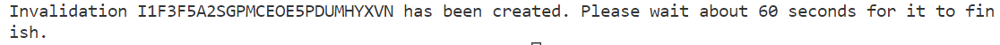
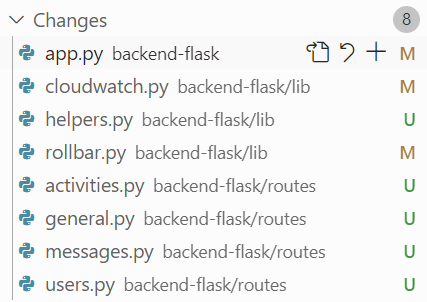

# Week X — Cleanup

Week X was all about implementing all changes that have been made during previous weeks to production, cleaning up the app and getting it to working condition. The frontend application's main functionalities are completed this week, although there are still more minor functionalities that should be completed to make the application fully functional for users. 

## Sync tool for static website hosting

As the frontend was originally built as a container, some changes were needed for the new implementation with CloudFront and S3. we created a new ``static build`` file that now builds the frontend with ``npm build`` instead of ``docker build``. 

We are using a library called aws_s3_website_sync, which Andrew Brown has made especially for syncing a folder from your local dev environment to the S3 bucket and then invalidates the CloudFront cache. We created a ``sync`` Ruby script that creates a change set based on the built frontend. Executing the changset upload the files to the S3 bucket and creates a CloudFront validation:

&nbsp;



&nbsp;

There is currently no CI/CD pipeline for CloudFront, but GitHub Actions workflow could be used for it.

&nbsp;

## Reconnect the RDS Database and Post Confirmation Lamba

The status in the beginning of the week was that our frontend had a CORS error and is not connected to data. The backend has a successful health check, but backend routes don’t connect to any data.

In order to reconnect the RDS database to our application, we updated the GitPod environment variable ``PROD_CONNECTION_URL`` to reflect the new database that was created via CFN. We first tested the connection locally and for that we had to add the GitPod URL to the security group of the RDS by using the ``update-sg-rule`` script that was created earlier in the bootcamp. Once the connection worked, we could run the schema load and seed the database. We also had to run the migrate script, as we had added the bio-field after completing the original schema. This is now done manually but could be automated by using CodeDeploy.

After the database was connected, we tried to register new users in the application. The Post Confirmation Lambda that is used to finish the created of a new user had several issue which had to be fixed for this to work. The Lambda had the old database URL as an environment variable, so this had to be updated to the new database. The correct way to reference the connection string would be using parameter store, however currently it is still listed directly as an environment variable. Then we noticed that the Lambda is inside the default VPC instead of the new VPC. So that needed to be changed and a new security group needed to be created. The new Lambda security group was then added to the database's inbound security group rules. 

&nbsp;

## Fix CORS to use a domain name for the web app

The service template.yaml had '*' as allowed origin, which had to be corrected to make the application more secure. The correct frontend and backend urls were added to the ``config.toml`` and re-deployed.

&nbsp;

## Ensure CI/CD pipeline works and create activity works

In the beginning of this week creating new activity was not working as creating a new Crud resulted into a 500 error. We modified several frontend files to use ``cognito_user_id`` instead of ``user handle``. I had also some hardcoded values there that had to be removed. Added actual users to seed.sql so that I can use in development the same users that I have in prod. I also found several small bugs in my application and after correcting all those, it was possible to create activities.

We wanted to make sure that the CI/CD pipeline works. When a new pull request was created and merged, the pipeline started to progress. Source stage succeeded, but build stage failed due to missing permissions. Once the required permissions were added, the pipeline worked:


&nbsp;

## Refactor to use JWT Decorator in Flask App

The reason we want to use a decorator is because when we want to clean up all of the functions in different files not to use hardcoded values, we end up doing a lot of manual changes in many places.

Added ``jwt_required function`` into ``cognito_jwt_token.py``. This function can now be imported into other files and used in other functions. This allows us to simplify the way the functions work. There is a default page where they will end up if not authenticated. 

## Refactor App.py

We have a lot of code where we have a model and it’s going to return something. That could be refactored by creating a new function. Added this function to App.py:

```
def return_model(model):
  if model['errors'] is not None:
    return model['errors'], 422
  else:
    return model['data'], 200
```

Re-factored all functions to use it.

Created new files in lib-folder for Xray, Honeycomb, Rollbar, CORS and moved all code from App.py related to those to the corresponding folders. Then imported and initialized them in App.py

## Refactor Flask Routes

All routes were in App.py and it looked quite messy and difficult to navigate.  Added several new files and moved routes from app.py to them:



## Implement Replies for Posts

## Improved Error Handling for the app

## 	Activities Show Page

## More General Cleanup 

## 
