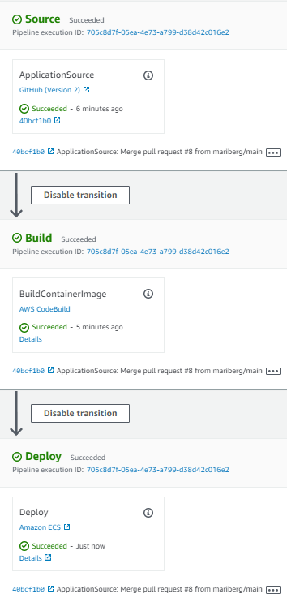
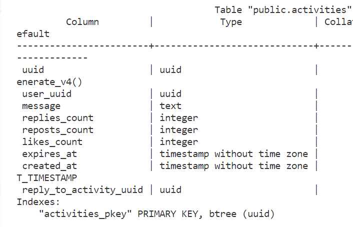

# Week X — Cleanup

Week X was all about deploying all changes that have been made during previous weeks to production, refactoring code, cleaning up the app and getting it to working condition. The frontend application's main functionalities are completed this week, although there are still more minor functionalities that should be completed to make the application fully functional for users. 

&nbsp;

## Sync tool for static website hosting

As the frontend was originally built as a container, some changes were needed for the new implementation with CloudFront and S3. we created a new ``static build`` file that now builds the frontend with ``npm build`` instead of ``docker build``. 

We are using a library called aws_s3_website_sync, which Andrew Brown has made especially for syncing a folder from your local dev environment to the S3 bucket and then invalidates the CloudFront cache. We created a ``sync`` Ruby script that creates a change set based on the built frontend. Executing the changset upload the files to the S3 bucket and creates a CloudFront validation:

&nbsp;


&nbsp;

There is currently no CI/CD pipeline for CloudFront, but GitHub Actions workflow could be used for it.

&nbsp;

## Reconnect the RDS Database and Post Confirmation Lamba

The status in the beginning of the week was that our frontend had a CORS error and is not connected to data. The backend has a successful health check, but backend routes don’t connect to any data.

In order to reconnect the RDS database to our application, we updated the GitPod environment variable ``PROD_CONNECTION_URL`` to reflect the new database that was created via CFN. We first tested the connection locally and for that we had to add the GitPod URL to the security group of the RDS by using the ``update-sg-rule`` script that was created earlier in the bootcamp. Once the connection worked, we could run the schema load and seed the database. We also had to run the migrate script, as we had added the bio-field after completing the original schema. This is now done manually but could be automated by using CodeDeploy.

After the database was connected, we tried to register new users in the application. The Post Confirmation Lambda that is used to finish the created of a new user had several issue which had to be fixed for this to work. The Lambda had the old database URL as an environment variable, so this had to be updated to the new database. The correct way to reference the connection string would be using parameter store, however currently it is still listed directly as an environment variable. Then we noticed that the Lambda is inside the default VPC instead of the new VPC. So that needed to be changed and a new security group needed to be created. The new Lambda security group was then added to the database's inbound security group rules. 

&nbsp;

## Fix CORS to use a domain name for the web app

The service template.yaml had '*' as allowed origin, which had to be corrected to make the application more secure. The correct frontend and backend urls were added to the ``config.toml`` and re-deployed.

&nbsp;

## Ensure CI/CD pipeline works and create activity works

In the beginning of this week creating new activity was not working as creating a new Crud resulted into a 500 error. We modified several frontend files to use ``cognito_user_id`` instead of ``user handle``. I had also some hardcoded values there that had to be removed. Added actual users to seed.sql so that I can use in development the same users that I have in prod. I also found several small bugs in my application and after correcting all those, it was possible to create activities.

We wanted to make sure that the CI/CD pipeline works. When a new pull request was created and merged, the pipeline started to progress. Source stage succeeded, but build stage failed due to missing permissions. Once the required permissions were added, the pipeline worked:

&nbsp;



&nbsp;

## Refactor to use JWT Decorator in Flask App

The reason we want to use a decorator is because when we want to clean up all of the functions in different files not to use hardcoded values, we end up doing a lot of manual changes in many places.

Added ``jwt_required function`` into ``cognito_jwt_token.py``. This function can now be imported into other files and used in other functions. This allows us to simplify the way the functions work. There is a default page where they will end up if not authenticated. 

&nbsp;

## Refactor App.py

We have a lot of code where we have a model and it’s going to return something. That could be refactored by creating a new function. Added this function to App.py:

```
def return_model(model):
  if model['errors'] is not None:
    return model['errors'], 422
  else:
    return model['data'], 200
```

Re-factored all functions to use it.

Created new files in lib-folder for Xray, Honeycomb, Rollbar, CORS and moved all code from App.py related to those to the corresponding folders. Then imported and initialized them in App.py

&nbsp;

## Refactor Flask Routes

All routes were in App.py and it looked quite messy and difficult to navigate.  Added several new files and moved routes from app.py to them:


&nbsp;

## Implement Replies for Posts

There was no implementation yet to handle writing replies to activities. When starting to implement this, the first issue we ran into was the fact that ``reply_to_activity_uuid`` had been set up as an integer instead of uuid. In order to change this, we generated a migration file:
```
class ReplayToActivityUuidToStringMigration:
  def migrate_sql():
    data = """
    ALTER TABLE activities DROP COLUMN reply_to_activity_uuid;
    ALTER TABLE activities ADD COLUMN reply_to_activity_uuid uuid;
    """
    return data
  def rollback_sql():
    data = """
    ALTER TABLE activities DROP COLUMN reply_to_activity_uuid;
    ALTER TABLE activities ADD COLUMN reply_to_activity_uuid integer;
    """
    return data
```
Running ``./bin/db/migrate`` should run all migration files that haven't yet been run based on the ``last_successful_run`` (in this case adding the bio-field). It turned out that this value had not been set correctly so it didn't work. 

Furthermore, I noticed my migration files timestamps are not consistent with same number of digits. The first migration (bio-field) had 17 digits, whereas the new migrations had either 15 or 15 digits. As the script was looking for the biggest number, it never ran the new migration. I fixed this by adding ``.zill(17`` to the code:

```
timestamp = str(time.time()).replace(".","").zfill(17)
```

There was also an error in the migrate script, which caused it to run only the first migration. The issue was caused by incorrect value for ``last_successful_run``. The code had to be changed from ``last_successful_run = set_last_successful_run(timestamp)`` to ``last_successful_run = set_last_successful_run(file_time)``. After this fix all migration files were run.

Reply_to_activity_uuid is now type uuid instead of integer:



Now the difference between original messages and replies in our database is, that original messages don't have any ``reply_to_activity_uuid``, whereare replies have it populated.

Created a new file ``show.sql`` to display a single activity. 

&nbsp;

## Improved Error Handling for the app

We wanted our app to display some kind of errors when a user tries to submit and empty form or a form with errors. Added ``FormErrors.js`` and ``FormErrorItem.js``

Started to go through all different forms that we have and import in them the new FormErrors component and post from lib/Requests. After these changes all of the forms will display better error messages to users so that they can understand what is going on.

&nbsp;

## Refactor Fetch Requests

Created new file Requests.js where we put all different fetch requests (put, post, get).

After updating all  forms with error handling, we also had to update all functions where fetch is being used.  We looked at all the different fetch functions we have and we ignore the once that are not calling our backend (presigned URL for example).

Updated a lot of files in total. What is in common now is that everything is importing lib/Requests and for this reason the post,put,get requests in individual components have been simplified a lot and code is a lot shorter and easier to understand.

Added to ``Request.js`` ``options``. The idea is that we can have some routes that require authorization and other that don’t, 

Changed the code to a little bit different one in the end to get it work and had to then update all files that use the fetch requests.

&nbsp;

## 	Activities Show Page

Made changes to ``ActivityContent.css`` so that we can more easily see which fields are clickable while hovering over them. A user name will be underlined when we hover over it and it tells us that we can click it to view their profile. 

Removed Replies from ActivityItem and created a new file Replies.js as it didn’t work as intended. Created another new file ActivityShowPage. We copies a lot of content from Activityfeed and we are not renaming everything so that we can simply use the same css.

Added a new path to app.js:

```sql
{
    path: "/@:handle/status/:activity_uuid",
    element: <ActivityShowPage />
  },
```

New route also added to users.py.

Created new file ``ActivityShowItem.js``. Change ActivityShowpage to display ActivityShowItem instead of ActivityItem.

&nbsp;

## Connect to DynamoDB

In terms of the IAM user, we should NOT have used a main user with Admin privileges to update the DynamoDB. If someone managed to get into our container, they could potentially get some kind of access to our user. We created a new ``template.yaml`` and ``config toml`` for machineuser. After the new user was created through CFN,  went to IAM to take the access keys and updated those in the parameter store.

To fix the DynamoDB to use production:

- updated all table ins ``ddb.py`` from hardcoded cruddur-messages to os.getenv("DDB_MESSAGE_TABLE")
- put the hardcoded dev name ‘cruddur-messages’ on backend-flask.env.erb so that we can use it when running locally. We don’t have any clever way to switch between dev and prod. If we want to use the production database when testing locally, we can simply replace it with the production DB name in the env file
- updated the service ``config.toml`` with the production DDB name
- added to service cfn ``template.yaml`` a new parameter for DDB. Default is cruddur-messages, which we can use if we remove the one from ``config.toml``
  
Ran ``./bin/cfn/service_deploy`` as we need to update our task definition with the new DDB name. As our task definition and service are on the same CFN template, it means that we will now take the ECS service down as well. This is something that we might not want to do, so it might be better to have the task definition on a separate CFN template. We would normally want to update our service only via the CICD pipeline where we have a suitable rollback etc in place.

&nbsp;

## More General Cleanup 

Made changes so that we can go to the home page and each item will have a different colours while we hover it and we can then click it and an individual Crud will open (it would display replies if there are). Something wrong with my implementation as it doesn’t change colour and by clicking I also end up in default (’nothing to see here yet’). 

Another issue we had was that we had to manually refresh the page after writing reply in order to see the new message. This was fixed this by adding ``setReplies`` to ``activityShowPage``. 

After these changes our frontend application was in an acceptable state, although many functionalities such as replies count are not working yet.

Now it was time to move on to make sure that all changes we have made are implemented in production. We ran the database migration scripts now against production, so that the ``bio-field`` is added and ``reply_to_activity_uuid`` type changed from integer to uuid.

Created a pull request to merge main into prod to update the backend via CodePipeline.

To update the frontend, we ran:
./bin/frontend/static-build
./bin/frontend/sync


